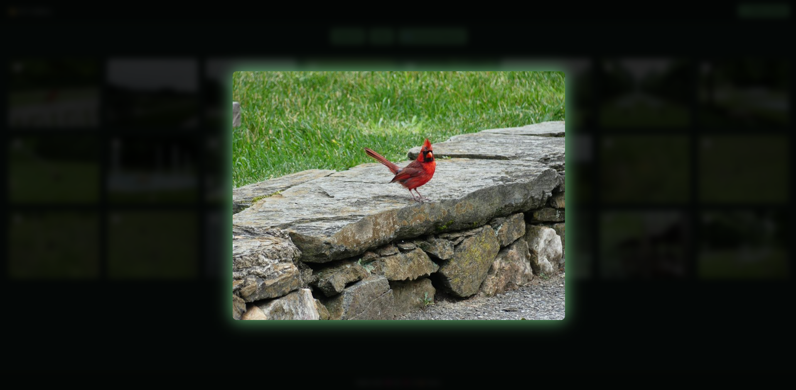
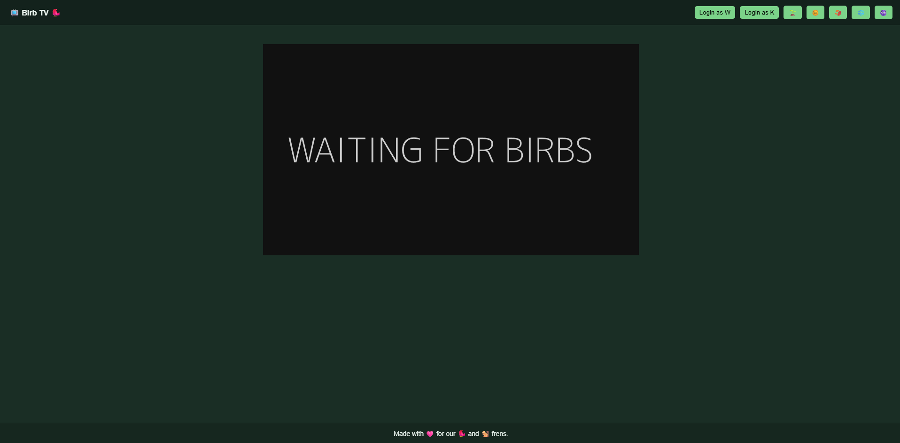

# Birb TV
A Flask camera app with manual capture, separate galleries, protected actions, and live streaming.

## Screenshots

### Live Feed View 


### Gallery View


### Single Photo View


### Video Feed Issue Warning


## Features
- Live video stream
- Manual capture buttons
- Separate galleries
- Download selected photos
- Delete all photos (purge)
- Choice of color themes

## Requirements
- Python 3.8 or higher
- A working camera (USB or Raspberry Pi camera)
- Linux recommended (Raspberry Pi OS)

## Setup
- Install virtual environment support
```
sudo apt install python3-venv -y
```
- Create the virtual environment
```
python3 -m venv venv
```
- Activate the virtual environment
```
source venv/bin/activate
```
- Install dependencies
```
pip install flask opencv-python-headless python-dotenv
```
- Run the app
```
python app.py
```
- Navigate to
```
http://YOUR_IP_ADDRESS:5000
```

## Thanks & Acknowledgements
- Photos by [w1ll5](https://w1ll5.com), taken at Longwood Gardens, Pennsylvania
- Video feed placeholder by [Dynamic Dummy Image Generator](https://dummyimage.com/)
